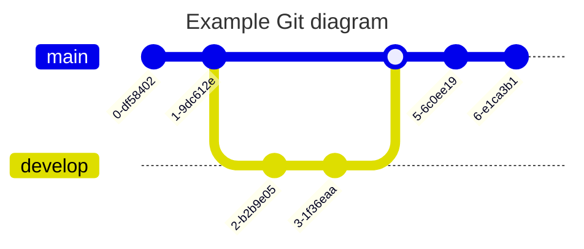

# Titolo originale
## Sottotitolo 1
### Titolo paragrafo

> esempio di quote (citazione)

esempio di __grassetto__ o **bold**

esempio _italic_

- primo
    - sottoelenco
- secondo
    - sottoelenco
- terzo
- quarto
- quinto

## esempio di check 

- [ ] uno
- [ ] due

backtick

' (alt 96) 

```
git status
git add
git commit
```

```html
<div>
<p>hello</p>
</div>
```


| Syntax | Description |
| --------- | ---------- |
| Header | Title |
|paragraph|text|

<details>
<summary>Tips for collapsed section
</summary>
You can add a text here
</details>


