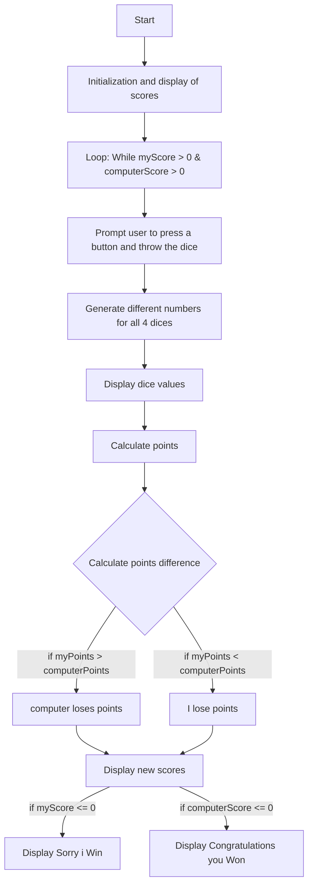

# Gioco dei dadi

```mermaid
flowchart TD
    A[Start] --> B[Initialization and display of scores]
    B --> C[Loop: While myScore > 0 & computerScore > 0
    ]
    C --> D[Prompt user to press a button and throw the dice]
    D --> E[Generate different numbers for all 4 dices]
    E --> F[Display dice values]
    F --> G[Calculate points]
    G --> H{Calculate points difference}
    H -- if myPoints > computerPoints -->I[computer loses points]
    H -- if myPoints < computerPoints -->J[I lose points]
    I --> K[Display new scores]
    J --> K
    K -- if myScore <= 0 --> L[Display Sorry i Win]
    K -- if computerScore <= 0 --> M[Display Congratulations you Won]
```
