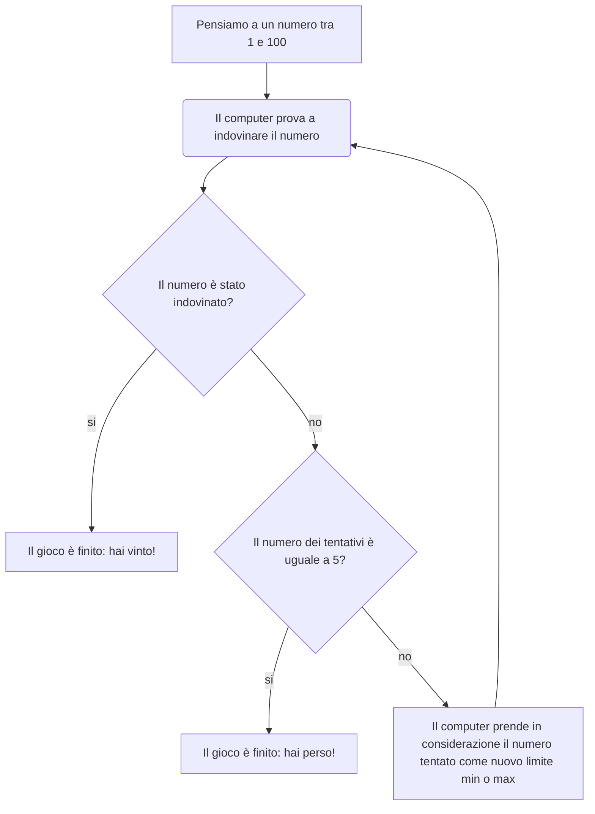

# Gioco dei dadi con tentativi FLOWCHART

```mermaid
flowchart TD
    A[Pensiamo a un numero tra 1 e 100] --> B(Il computer prova a indovinare il numero )
    B -->C{Il numero è stato indovinato?}
    C -->|si|D[Il gioco è finito: hai vinto!]
    C -->|no| E{Il numero dei tentativi è uguale a 5?}
    E -->|si|F[Il gioco è finito: hai perso!]
    E -->|no|G[Il computer prende in considerazione il numero tentato come nuovo limite min o max]
    G -->B
```