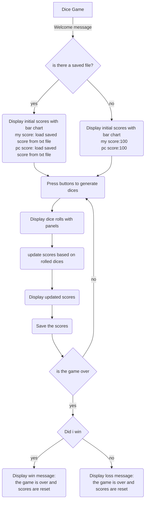

# Dice Game

```mermaid
flowchart TD
    A[Dice Game] -->|Welcome message| B{is there a saved file?}
    B --> |no| C(Display initial scores with bar chart
    my score:100
    pc score:100)
    B --> |yes| G(Display initial scores with bar chart
    my score: load saved score from txt file
    pc score: load saved score from txt file)
    G --> D
    C -->D(Press buttons to generate dices)
    D -->E(Display dice rolls with panels)
    E -->F(update scores based on rolled dices)
    F -->H(Display updated scores)
    H -->I(Save the scores)
    I -->J{is the game over}
    J -->|yes| K{Did i win}
    K -->|yes| L(Display win message:
    the game is over and scores are reset)
    K -->|no| N(Display loss message:
    the game is over and scores are reset)
    J --> |no| D
```