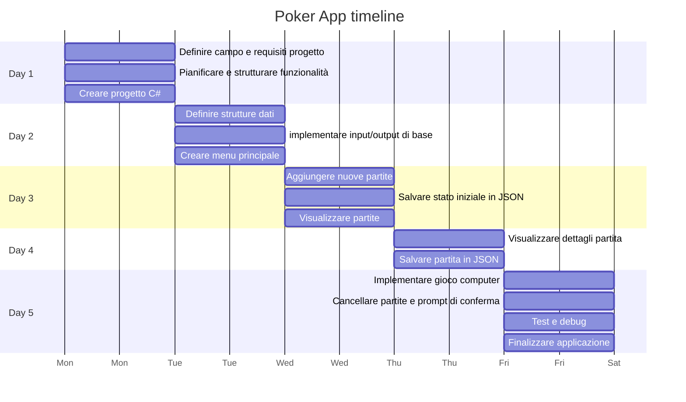
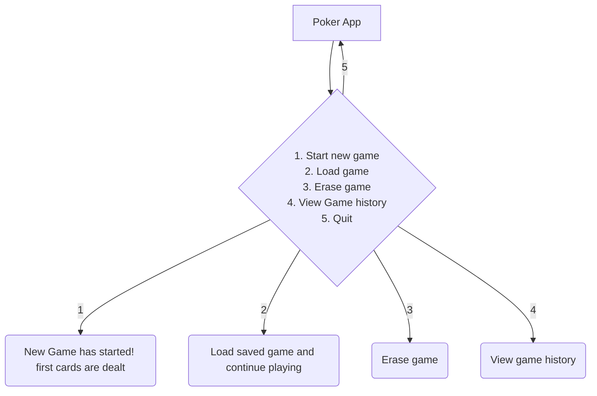

# Poker Texas Holdem App

Un'applicazione per giocare a poker contro il computer

## _Obiettivi applicazione_:

L'obiettivo principale dell'applicazione "Poker Texas Hold'em" è di fornire agli utenti un'esperienza di gioco coinvolgente e divertente, dove possono giocare a poker contro il computer in un formato 1v1.
 Gli obiettivi specifici includono:

- __Divertimento__:  Offrire un'esperienza di gioco appagante e realistica, simile a una partita di poker reale.
- __Competizione__: Consentire agli utenti di sfidare il computer con un'intelligenza artificiale adeguata.
- __Gestione delle partite__: Permettere all'utente di `salvare`, `visualizzare` e `cancellare` le partite giocate.
- __Accessibilità__: Creare un'interfaccia utente semplice e intuitiva che renda facile per i giocatori avviare nuove partite e gestire le partite esistenti.

## _Funzionalità chiave_

l'applicazione deve includere le seguenti funzionalità chiave:

- __Aggiunta di nuove partite__:

    - [x] Creare una nuova partita di poker

- __Visualizzazione dei dettagli delle partite__:

   
    - [x] Visualizzare i dettagli di una partita specifica, incluse le puntate dei giocatori e lo stato delle carte.

- __Aggiornamento delle partite__:

    - [x] Consentire agli utenti di riprendere una partita salvata e continuare a giocare.
    - [x] Salvataggio automatico della partita.

- __Cancellazione delle partite__:

    - [x] Permettere agli utenti di eliminare una partita salvata.

- __Gioco contro il computer__:

    - [ ] Implementare una logica di gioco per il computer che simuli un avversario realistico.
    - [x] Gestire le varie fasi del gioco (pre-flop, flop, turn, river) con decisioni automatiche del computer.

## _Analisi target e esigenze utenti_

- __pubblico target__:
    - appassionati di poker: Persone che amano giocare a poker e vogliono migliorare le loro abilità sfidando il computer.
    - nuovi giocatori: Individui che desiderano imparare a giocare a poker Texas Hold'em in un ambiente non competitivo.
    - giocatori casual: Persone che cercano un passatempo divertente e stimolante.
    - Utenti tecnologici: Persone che apprezzano i giochi digitali e desiderano un'applicazione ben progettata e funzionante.

- __esigenze degli utenti__:
    - [x] Interfaccia intuitiva: Un'interfaccia facile da usare che permetta di avviare e gestire le partite senza difficoltà.
    - [ ] Esperienza di gioco realistica: Un'IA per il computer che offra una sfida adeguata e che rispecchi il comportamento di un giocatore reale.
    - [x] Funzionalità di gestione delle partite: Possibilità di salvare, visualizzare e cancellare le partite per tenere traccia dei propri progressi e delle proprie prestazioni.
    

## _Definizione di strutture e convenzioni_

- inizialmente tutte le variabili sono in camelCase tranne le funzioni in PascalCase

## GANTT TIMELINE

## FlowChart

# To do list

- [x] Fix high card evaluation
- [x] Fix betting rounds mechanics
- [x] Fix double bet
- [x] improve graphics
- [x] Fix raise amount
- [x] Fix fullhouse evaluation, program thinks three of a kind is fullhouse
- [x] Fix Higher pair wins, regardless of kicker
- [x] Fix when player checks the action should pass to pc
- [x] Fix Straight A to 5 evaluation missing
- [x] Fix when both players have two pair, the highest pair wins and not the player with best kicker
- [x] Implement a better showing of the best combination at the end of the hand
- [ ] Implement realistic computer action
- [ ] Fix straight flush evaluation when it is actually just straight
- [ ] Fix when players have same exact hand(straight for example) don't let winner be higher kicker but make it a tie
- [ ] Fix when both players have best hand with community cards, the result is a tie and the player with higher card doesn't win
- [ ] Fix high card evaluation when players have same score
- [ ] Fix game mechanics when players use all their stack, they shouldn't be able to make more bets
- [ ] Integrate all in action and showdown
- [x] Include try and catch for errors

