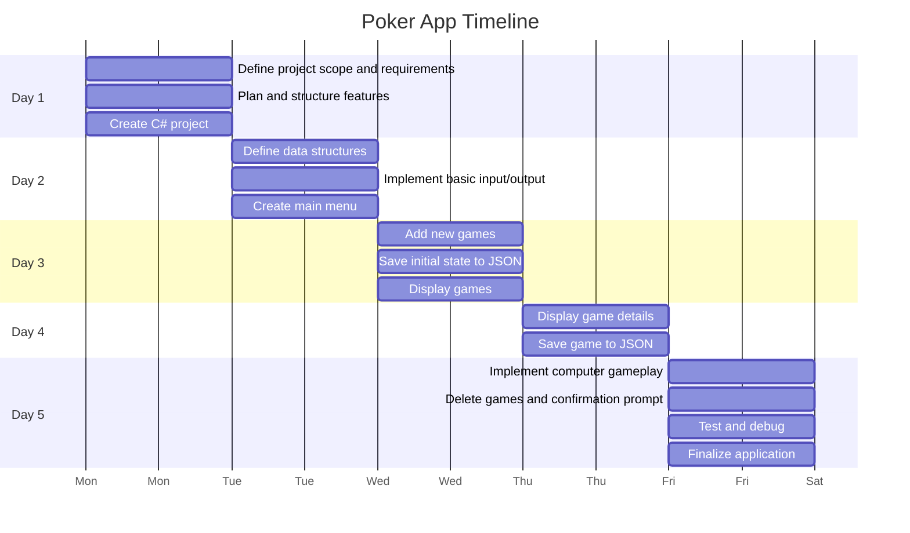
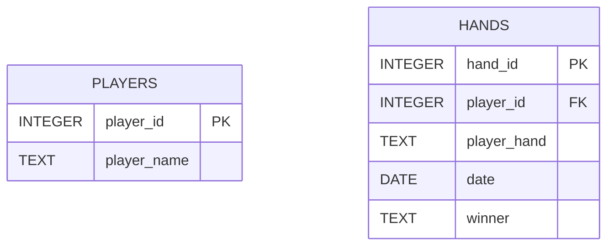
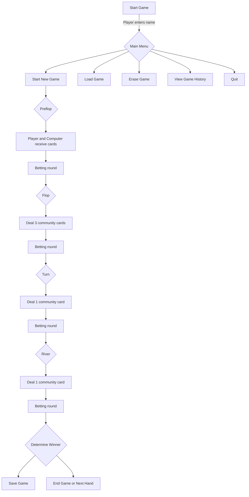

# Poker Texas Holdem App

An application to play poker against the computer.

## _Application Objectives_:

The main goal of the "Poker Texas Hold'em" application is to provide users with an engaging and enjoyable gaming experience, where they can play poker against the computer in a 1v1 format. Specific objectives include:

- __Fun__:  Provide a satisfying and realistic gaming experience, similar to a real poker match.
- __Competition__: Allow users to challenge the computer with adequate artificial intelligence.
- __Game Management__: Allow users to `save`, `view`, and `delete` the games they have played.
- __Accessibility__:  Create a simple and intuitive user interface that makes it easy for players to start new games and manage existing games.

## _Key Features_

The application includes the following key features:

- __Add New Games__:

    - [x] Create a new poker game

- __View Game Details__:

   
    - [x] View the details of a specific game, including player bets and card statuses.

- __Update Games__:

    - [x] Allow users to resume a saved game and continue playing.
    - [x] Automatic saving of the game state.

- __Delete games__:

    - [x] Allow users to delete a saved game.

- __Play against the computer__:

    - [ ] Implement game logic for the computer that simulates a realistic opponent.
    - [x] Manage the various phases of the game (pre-flop, flop, turn, river) with automatic decisions by the computer.

## _Target Audience and User Needs Analysis_

- __Target Audience__:
    - Poker enthusiasts: People who love to play poker and want to improve their skills by challenging the computer.
    - New players: Individuals who want to learn how to play Texas Hold'em poker in a non-competitive environment.
    - Casual players: People looking for a fun and challenging pastime.
    - Tech-savvy users: People who appreciate digital games and desire a well-designed and functional application.

- __User Needs__:
    - [x] Intuitive Interface: An easy-to-use interface that allows starting and managing games without difficulty.
    - [ ] Realistic Gameplay: An AI for the computer that offers an adequate challenge and mimics the behavior of a real player.
    - [x] Game Management Features: The ability to save, view, and delete games to track progress and performance.
    

## _Definition of Structures and Conventions_

- Initially, all variables are in camelCase except for functions, which are in PascalCase.

## GANTT TIMELINE

# How it Works

## Game flow

The player begins by selecting from the main menu:

Poker App
-------------------
1. Start new game
2. Load game
3. Erase game
4. View game history
5. Quit

Upon starting a new game, the player and the computer are dealt cards, and a series of betting rounds are conducted through the Preflop, Flop, Turn, and River stages.

At the end of each hand:

- The winner is determined based on standard poker rules.
- If the player or computer runs out of chips, the game ends.

## Database Structure

The game utilizes SQLite to store player information and hand history. The following tables are used:

## Game Process

The poker game progresses through different stages, including:

- Preflop: Both the player and the computer receive their initial two cards.
- Flop: Three community cards are dealt.
- Turn: One additional community card is dealt.
- River: The final community card is dealt.

During each stage, a round of betting occurs. At the end of the River stage, the winner is determined.

## Saving and Loading

- Saving: The current game state (including player stack, computer stack, community cards, and hand history) is saved both to a JSON file and an SQLite database after each hand.
- Loading: The game state can be restored by reading from the JSON file and database.

## Hand Evaluation

At the end of the hand, the winner is determined based on the player's and computer's card combination, following standard poker rules (e.g., Straight, Flush, Full House, etc.).

# How to Run

Ensure you have SQLite and Newtonsoft.Json installed.
Build and run the C# project in Visual Studio or using dotnet.
Follow the prompts in the console to start a game, load a previous game, or view hand history.

# To do list

- [x] Fix high card evaluation
- [x] Fix betting rounds mechanics
- [x] Fix double bet
- [x] improve graphics
- [x] Fix raise amount
- [x] Fix fullhouse evaluation, program thinks three of a kind is fullhouse
- [x] Fix Higher pair wins, regardless of kicker
- [x] Fix when player checks the action should pass to pc
- [x] Fix Straight A to 5 evaluation missing
- [x] Implement a better showing of the best combination at the end of the hand
- [ ] Fix one Pair evaluation
- [x] Fix when both players have two pair, the highest pair wins and not the player with best kicker
- [ ] Implement realistic computer action
- [ ] Fix straight flush evaluation when it is actually just straight
- [x] Fix when players have same exact hand(straight for example) don't let winner be higher kicker but make it a tie
- [ ] Fix when both players have best hand with community cards, the result is a tie and the player with higher card doesn't win
- [ ] Fix high card evaluation when players have same score
- [ ] Fix game mechanics when players use all their stack, they shouldn't be able to make more bets
- [ ] Integrate all in action and showdown
- [ ] Improve JSON File Saving
- [x] Include try and catch for errors

