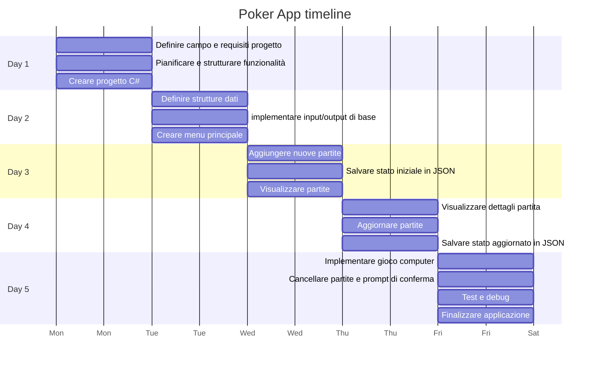
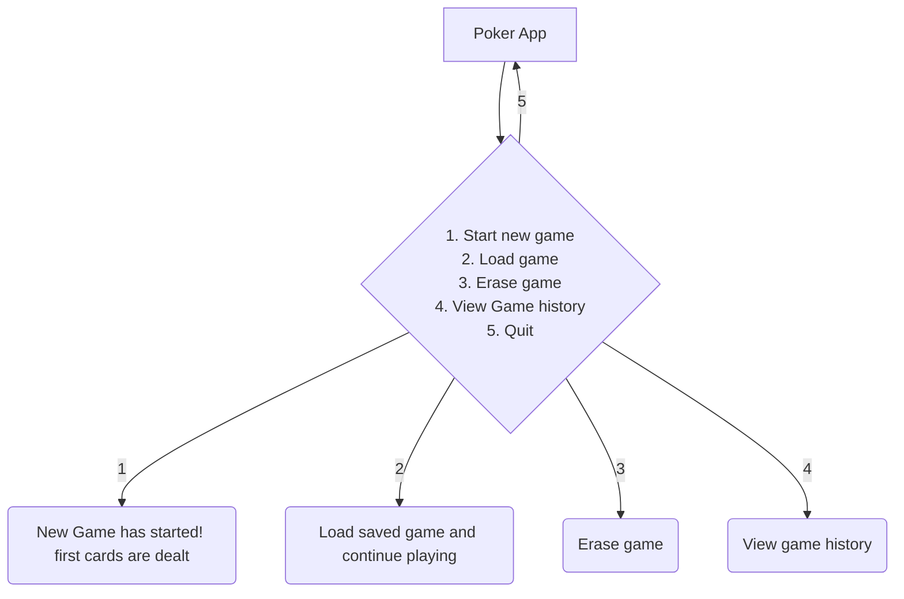

# Poker Texas Holdem App

Un'applicazione per giocare a poker contro il computer

## _Obiettivi applicazione_:

L'obiettivo principale dell'applicazione "Poker Texas Hold'em" è di fornire agli utenti un'esperienza di gioco coinvolgente e divertente, dove possono giocare a poker contro il computer in un formato 1v1.
 Gli obiettivi specifici includono:

- __Divertimento__:  Offrire un'esperienza di gioco appagante e realistica, simile a una partita di poker reale.
- __Competizione__: Consentire agli utenti di sfidare il computer con un'intelligenza artificiale adeguata.
- __Gestione delle partite__: Permettere all'utente di salvare, visualizzare e cancellare le partite giocate.
- __Accessibilità__: Creare un'interfaccia utente semplice e intuitiva che renda facile per i giocatori avviare nuove partite e gestire le partite esistenti.

## _Funzionalità chiave_

l'applicazione deve includere le seguenti funzionalità chiave:

- __Aggiunta di nuove partite__:

    - Creare una nuova partita di poker
    - Salvare lo stato iniziale della partita con le informazioni dei giocatori e le carte distribuite.

- __Visualizzazione dei dettagli delle partite__:

    - Elencare tutte le partite salvate con informazioni di base (ID partita, data, risultato).
    - Visualizzare i dettagli di una partita specifica, inclusi i movimenti dei giocatori e lo stato delle carte.

- __Aggiornamento delle partite__:

    - Consentire agli utenti di riprendere una partita salvata e continuare a giocare.
    - Salvare lo stato aggiornato della partita in qualsiasi momento.

- __Cancellazione delle partite__:

    - Permettere agli utenti di eliminare una partita salvata.
    - Confermare l'azione per prevenire cancellazioni accidentali.

- __Gioco contro il computer__:

    - Implementare una logica di gioco per il computer che simuli un avversario realistico.
    - Gestire le varie fasi del gioco (pre-flop, flop, turn, river) con decisioni automatiche del computer.

## _Analisi target e esigenze utenti_

- __pubblico target__:
    - appassionati di poker: Persone che amano giocare a poker e vogliono migliorare le loro abilità sfidando il computer.
    - nuovi giocatori: Individui che desiderano imparare a giocare a poker Texas Hold'em in un ambiente non competitivo.
    - giocatori casual: Persone che cercano un passatempo divertente e stimolante.
    - Utenti tecnologici: Persone che apprezzano i giochi digitali e desiderano un'applicazione ben progettata e funzionante.

- __esigenze degli utenti__:
    - Interfaccia intuitiva: Un'interfaccia facile da usare che permetta di avviare e gestire le partite senza difficoltà.
    - Esperienza di gioco realistica: Un'IA per il computer che offra una sfida adeguata e che rispecchi il comportamento di un giocatore reale.
    - Funzionalità di gestione delle partite: Possibilità di salvare, visualizzare, aggiornare e cancellare le partite per tenere traccia dei propri progressi e delle proprie prestazioni.
    - Divertimento e coinvolgimento: Un gioco che sia divertente da giocare, con elementi grafici e sonori che migliorino l'esperienza utente.

## _Definizione di strutture e convenzioni_

- inizialmente tutte le variabili sono in camelCase tranne le funzioni in PascalCase

## GANTT TIMELINE

## FlowChart

