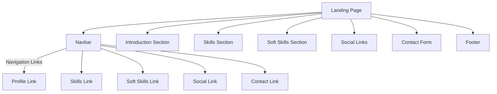

# Landing Page Structure

This README provides an overview of the HTML page structure, its sections, and relevant details. The page is built using **Bootstrap 5** for styling, **Font Awesome** for icons, and custom CSS for additional animations and effects.

## Technologies Used
- **HTML5**
- **Bootstrap 5.3**
- **Font Awesome**
- **Google Fonts**
- **Custom CSS**
- **JavaScript** (for tooltips and navbar interaction)

---

## Overview

 ### Introduction Section

This section includes a heading introducing the developer, a short personal description, and a "Contact Me" button that links to the contact section.

 #### Key Features:
- Animated headings using custom keyframes in CSS (slidein and slideinRight).
- Call to action button: "Contact Me!" linking to the contact section.

---

###  Hard Skills Section

- Displays progress bars for hard skills like HTML, CSS, JavaScript, and more.

### Soft Skills Section

- Displays cards with icons and descriptions for each soft skill, along with tooltips for further information.

#### Tooltip Feature:
- Each soft skill card has an associated tooltip that provides additional detail when hovered over.

--- 

### Social Links Section
- Contains large, clickable icons for GitHub and LinkedIn profiles.

---

### Contact Section
- A simple form where users can fill in their email address and message.

---

### Footer
- A basic footer with a copyright message.

